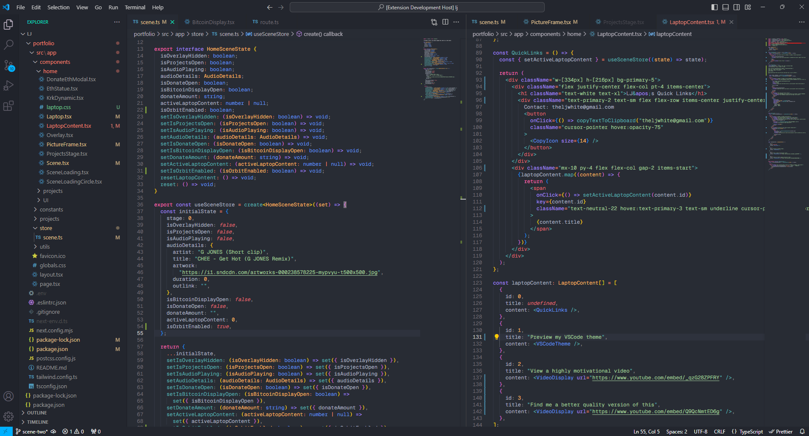

<div align="center">


# Ilyat Theme for VSCode

[](https://github.com/theljwhite/ilyat/releases/latest)
[](https://marketplace.visualstudio.com/items?itemName=ljwhite.ilyat-vscode)

</div>

**Ilyat** (ill·e·yot) `0.0.1` theme with several variations inspired by some of my favorite themes - **Eva**, **Mariana**, and **Poimandres**. 👾

## Easy Installation

1. Click on the **Exstensions** icon in VSCode sidebar.
2. Search for **Ilyat Theme**.
3. Click **Install** to install it.
4. Click **Reload** to reload your editor.
5. File ＞ Preferences ＞ Theme > Color Theme ＞ **Ilyat**.
6. Enjoy and [rate five-stars](https://marketplace.visualstudio.com/items?itemName=ljwhite.ilyat-vscode&ssr=false#review-details). 🌟 👽

**Ilyat**


**Ilyat Mariana**


**Ilyat Poimandres**


The screencaps above use the following settings in VSCode `settings.json`:

```json
{
  "editor.bracketPairColorization.enabled": true,
  "editor.fontSize": 12.2,
  "editor.fontFamily": "Geist Mono Variable"
}
```

## License

[MIT](https://github.com/release/theljwhite/ilyat/blob/master/LICENSE.md)
